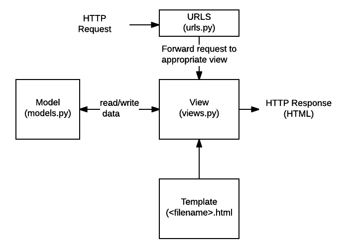

# django

### settings.py

> database
> 만약 database를 잘못사용해서 lock 되면 database를 다른 이름으로 하나 더 생성

```
DATABASES = {
    'default': {
        'ENGINE': 'django.db.backends.sqlite3',
        'NAME': os.path.join(BASE_DIR, 'db.sqlite3'),
    }
}
```
여기에서 'NAME': os.path.join(BASE_DIR, 'db2.sqlite3'), 이런 식으로


<br>

### urls.py

```
from django.contrib import admin
from django.urls import path, include
from firstapp import views

urlpatterns = [
    path('admin/', admin.site.urls),
    path('index1/', views.index1),
    path('index2/', views.index2),
    path('firstapp/', include('firstapp.urls')),
]
```

### 실행된 장고파일 여는 방법 2가지
1. localhost:8000/firstapp/
2. 127.0.0.1/firstapp

<br>

### views.py
> 뷰는 HTTP 요청을 수신하고 HTTP응답을 반환하는 요청 처리 함수이다. 뷰는 Model을 통해 요청을 충족시키는데 필> 요한 데이터에 접근한다. 그리고 템플릿에게 응답의 서식 설정을 맡긴다.

<br>

### admin.py
> adminpage에서 GUI를 통해 관리할 모델을 선언하는 페이지
> python manage.py createsuperuser 명령어를 통해 만든 관리자 ID, 비밀번호로 접근한다

```
from django.contrib import admin
from .models import Curriculum
from .models import Member
# Register your models here.

admin.site.register(Curriculum)
admin.site.register(Member)
```

* app을 만들어야 views.py, models.py, admin.py파일 생성
 python manage.py startapp firstapp

<br>

### templates
> 템플릿은 파일의 구조나 레이아웃을 정의하고 (ex. HTML page) 실제 내용을 보여주는데 사용되는 텍스트 파일이다
> 뷰는 HTML 템플릿을 이용해 동적으로 HTML 페이지를 만들고 모델에서 가져온 데이터로 채운다. 
> 템플릿으로 모든 파일의 구조를 정의할 수 있으며 템플릿은 꼭 HTML타입일 필요가 없다! (아래에서 이어짐)

<br>

### models.py
> app 에서 사용하기 위한 데이터베이스 테이블을 ORM(Object Relational Mapping)에 의거해 작성하는 파일
> 클래스는 DB에서 테이블과, 각 멤버 객체들은 column에 대응

```
class Member(models.Model):
    name = models.CharField(max_length=255)
    age = models.IntegerField()

    def __str__(self):
        return self.name
```

Tips

img랑 원래 web에서는 MVC 패턴으로 Model, View, Controller인데 장고에서는 Controller의 역할을 View가 해준다
=> 따라서, 장고는 이 구조를 "모델, 뷰, 템플릿 (MVT)" 아키텍쳐라고 부른다.

* 역할 - django에서 파일
Model - Model(model.py), Controller - View(views.py), View - Template(<filename>.html)



>  와 { endfor %}
Template의 html파일에서 views에서 보낸(모델에서 가져온 데이터) 데이터를 풀어서 보여줄때 사용한다
* 템플릿이 꼭 HTML 파일일 필요 X

```
<table>
        <tr>
            <td>이름</td>
            <td>나이</td>
        </tr>
        
        <tr>
            <td>{{ item.name }}</td>
            <td>{{ item.age }}</td>
        </tr>
        
    </table>
```
